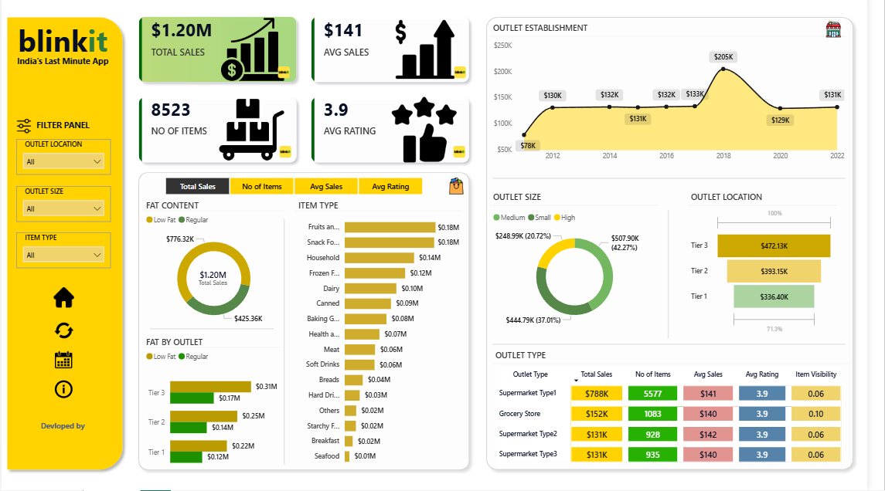

# 🛒 Blinkit Sales Analysis Dashboard

## Dashboard Preview

## Project Overview
# 🛒 Blinkit Sales Analysis Dashboard

## 📊 Project Overview

This Power BI project analyzes Blinkit's sales performance, customer satisfaction, and inventory distribution. The dashboard provides business insights through interactive visualizations and KPI tracking to support data-driven decision-making.

---

## 🎯 Business Objective

The objective of this project is to:

* Analyze overall sales performance.
* Monitor customer satisfaction through ratings.
* Understand inventory distribution across outlets.
* Compare sales across outlet types, locations, and sizes.
* Identify high-performing product categories.
* Generate actionable business insights for optimization.

---

## 🛠 Tools & Technologies Used

* Power BI
* Power Query
* DAX
* Data Modeling
* Data Visualization
* Microsoft Excel

---

## 📈 Key Performance Indicators (KPIs)

### 💰 Total Sales

Overall revenue generated from all products sold.

### 📊 Average Sales

Average revenue generated per transaction.

### 📦 Number of Items

Total count of products sold.

### ⭐ Average Rating

Average customer satisfaction rating.

---

## 📉 Dashboard Analysis

### Total Sales by Fat Content

Analyzes the impact of Low Fat and Regular products on overall sales performance.

### Total Sales by Item Type

Identifies the best-performing product categories based on revenue generated.

### Fat Content by Outlet

Compares sales across outlet tiers segmented by fat content.

### Total Sales by Outlet Establishment

Analyzes how outlet establishment year influences sales performance.

### Sales by Outlet Size

Evaluates sales contribution from Small, Medium, and Large outlets.

### Sales by Outlet Location

Analyzes geographical sales distribution across outlet tiers.

### Metrics by Outlet Type

Provides a consolidated view of:

* Total Sales
* Average Sales
* Number of Items
* Average Rating

for each outlet type.

---

## 🔄 Project Workflow

1. Requirement Gathering
2. Data Collection
3. Data Cleaning
4. Data Modeling
5. Data Processing
6. DAX Calculations
7. Dashboard Design
8. Visualization Development
9. Insights Generation

---

## 📌 Business Insights

* Identified top-performing product categories.
* Evaluated customer preferences based on fat content.
* Compared sales across outlet sizes and locations.
* Measured outlet performance using multiple KPIs.
* Provided visibility into customer satisfaction trends.

---

## 📂 Project Files

* Grocery Data.xlsx
* Blinkit Sales Dashboard.pbix
* Business Explanation.pptx

---

## 🚀 Outcome

The dashboard enables stakeholders to monitor business performance, understand customer behavior, optimize inventory distribution, and make informed strategic decisions using data-driven insights.
